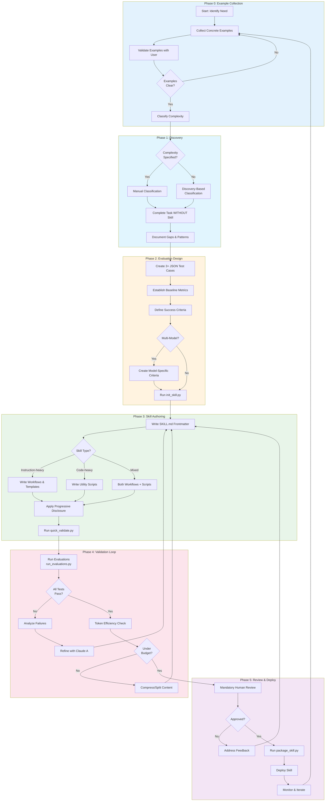
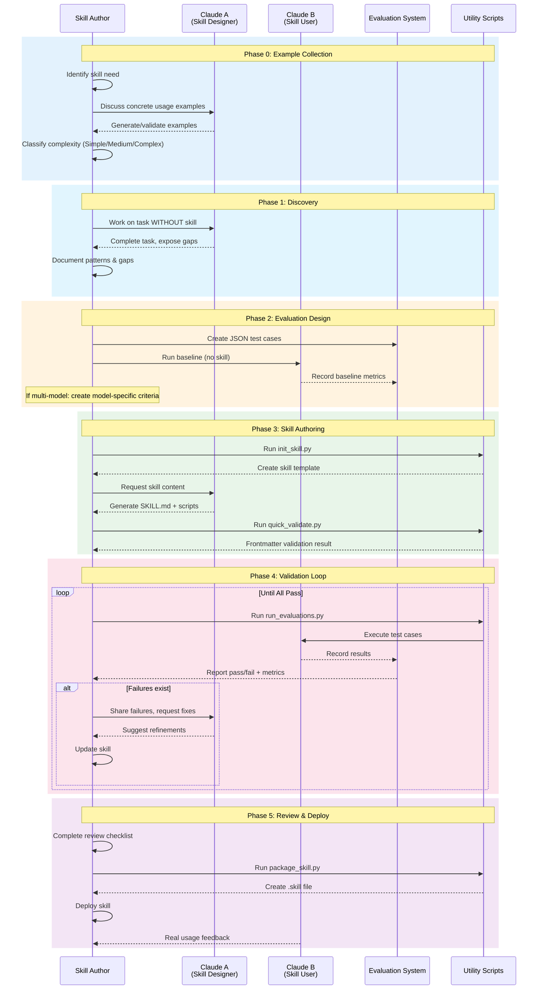
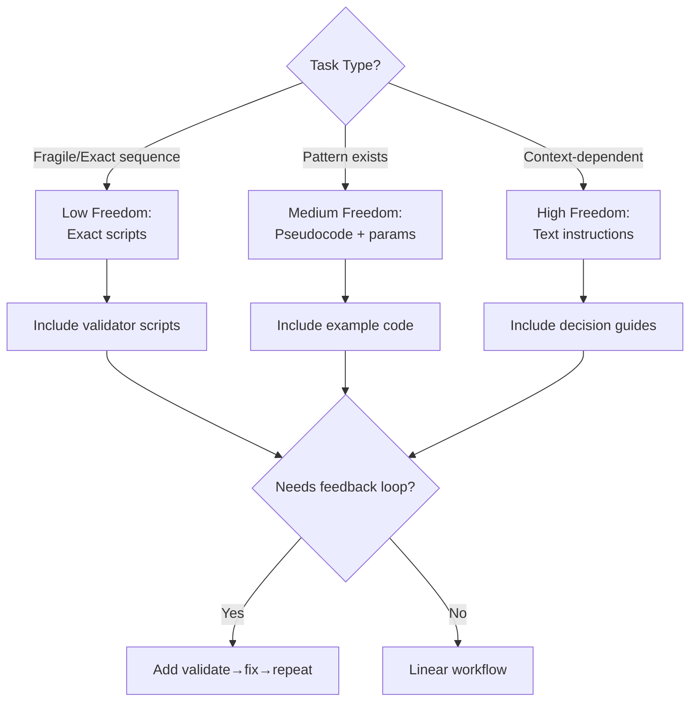
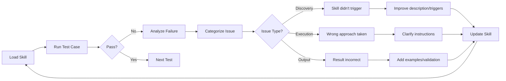
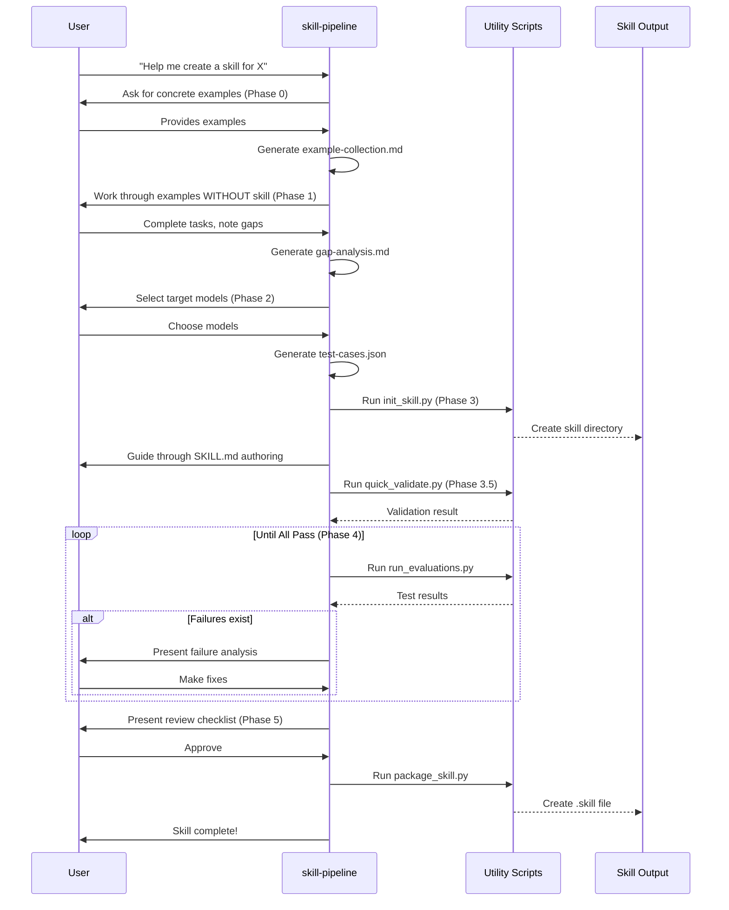

# Agent Skill Development Pipeline

## Overview

A systematic, evaluation-driven pipeline for building high-quality agent skills that prioritizes **output consistency** > **token efficiency** > **development speed**.

**Source Materials:**

- Best practices: `docs/en/agent-skills/best-practice.md`
- Official skill-creator: `.claude/skills/skill-creator/`

---

## Pipeline Architecture

### High-Level Flowchart



### Sequence Diagram: Iterative Development with Claude A/B



---

## Phase Details

### Phase 0: Example Collection (NEW)

**Goal**: Establish concrete understanding of how the skill will be used BEFORE any development.

**Why This Phase Exists**: The official skill-creator emphasizes that effective skills come from understanding concrete usage patterns first. This prevents building skills that solve imagined problems.

**Steps**:

1. **Identify Skill Need**:

   - What task/domain does this skill address?
   - Who will use it? (individual, team, organization)

2. **Collect Concrete Examples** (minimum 3):
   Ask or generate answers to:

   - "What would a user say that should trigger this skill?"
   - "What are specific examples of how this skill would be used?"
   - "What does success look like for each example?"

3. **Validate Examples with User**:

   - Confirm examples cover the intended scope
   - Identify edge cases
   - Remove out-of-scope examples

4. **Classify Complexity**:
   | Level | Characteristics | Expected Size |
   |-------|----------------|---------------|
   | Simple | Single workflow, no scripts | <100 lines |
   | Medium | Multiple workflows OR scripts | 100-300 lines |
   | Complex | Multi-domain, validation loops | >300 lines |

5. **Output**: Example Collection Document

   ```markdown
   ## Skill: [skill-name]

   ### Target Users

   [Individual/Team/Organization]

   ### Concrete Examples

   **Example 1**: [User trigger phrase]

   - Input: [What the user provides]
   - Expected Output: [What should happen]
   - Success Criteria: [How to verify]

   **Example 2**: [User trigger phrase]
   ...

   **Example 3**: [User trigger phrase]
   ...

   ### Complexity Classification

   - Level: [Simple/Medium/Complex]
   - Rationale: [Why this classification]

   ### Out of Scope

   - [What this skill will NOT do]
   ```

---

### Phase 1: Discovery (Identify Gaps)

**Goal**: Understand what context Claude lacks for a specific task domain.

**Steps**:

1. **Complete Task WITHOUT Skill**:

   - Work through EACH example from Phase 0 with Claude using normal prompting
   - Notice what information you repeatedly provide
   - Document specific failures or missing context

2. **Identify Reusable Resources** (from official skill-creator):
   For each example, analyze:

   - What code would need to be rewritten each time? → `scripts/`
   - What documentation would Claude need to reference? → `references/`
   - What templates/assets would be copied each time? → `assets/`

3. **Output**: Gap Analysis Document

   ```markdown
   ## Gap Analysis: [skill-name]

   ### Context Repeatedly Provided

   - [Item 1]
   - [Item 2]

   ### Failures Observed

   - [Failure 1]: Claude did X instead of Y
   - [Failure 2]: Missing knowledge about Z

   ### Patterns Identified

   - [Reusable pattern 1]
   - [Reusable pattern 2]

   ### Planned Resources

   - scripts/: [List of utility scripts needed]
   - references/: [List of reference docs needed]
   - assets/: [List of templates/assets needed]
   ```

---

### Phase 2: Evaluation Design

**Goal**: Create measurable success criteria BEFORE writing the skill.

**Steps**:

1. **Select Target Models**:
   Before creating test cases, decide which model(s) the skill will target:

   | Model  | Use Case               | Guidance Needs             |
   | ------ | ---------------------- | -------------------------- |
   | Haiku  | Fast, economical tasks | More explicit instructions |
   | Sonnet | Balanced performance   | Standard instructions      |
   | Opus   | Complex reasoning      | Can handle ambiguity       |

2. **Create 3+ JSON Test Cases**:

   ```json
   {
     "test_id": "pdf-001",
     "skills": ["pdf-processing"],
     "query": "Extract all tables from quarterly-report.pdf",
     "files": ["test-files/quarterly-report.pdf"],
     "expected_behavior": [
       "Uses pdfplumber or equivalent library",
       "Extracts tables from all pages",
       "Outputs structured data (CSV/JSON)"
     ],
     "success_criteria": {
       "must_pass": ["extracts_all_tables", "structured_output"],
       "should_pass": ["handles_merged_cells"]
     },
     "models": ["haiku", "sonnet", "opus"]
   }
   ```

3. **Establish Baseline** (per model):

   - Run test cases WITHOUT the skill on EACH target model
   - Record: success rate, token usage, execution time

4. **Define Success Criteria**:
   | Metric | Baseline | Target |
   |--------|----------|--------|
   | Success Rate | X% | ≥95% |
   | Token Usage | Y tokens | ≤Y×0.8 |
   | Consistency | Z% | ≥90% |

5. **Model-Specific Criteria** (if multi-model):

   ```markdown
   ## Model-Specific Adjustments

   ### Haiku

   - May need: More explicit step-by-step instructions
   - Watch for: Skipped validation steps
   - Token budget: Stricter (more cost-sensitive)

   ### Sonnet

   - Standard instructions should suffice
   - Watch for: Over-engineering solutions

   ### Opus

   - Can handle higher ambiguity
   - Watch for: Unnecessary complexity
   - Token budget: More flexible
   ```

6. **Output**: Evaluation Suite
   ```
   evaluations/
   ├── test-cases.json       # All test cases
   ├── baseline-results.json # Results without skill
   ├── test-files/           # Input files for tests
   │   ├── sample1.pdf
   │   └── sample2.xlsx
   └── model-criteria.md     # Model-specific criteria (if multi-model)
   ```

---

### Phase 3: Skill Authoring

**Goal**: Write minimal, effective skill content using the official tooling.

#### 3.0 Initialize with Official Script

**Always start by running `init_skill.py`** (extended from official skill-creator):

```bash
python scripts/init_skill.py <skill-name> --path <output-directory>
```

This creates:

```
<skill-name>/
├── SKILL.md          # Template with TODO placeholders
├── scripts/          # Utility scripts directory
│   └── example.py    # Example script (delete if unused)
├── references/       # Reference docs directory
│   └── api_reference.md  # Example reference (delete if unused)
└── assets/           # Templates/assets directory
    └── example_asset.txt  # Example asset (delete if unused)
```

#### 3.1 Frontmatter Template

```yaml
---
name: [verb-ing]-[noun]  # e.g., processing-pdfs
description: |
  [What it does]. [When to use it].
  Use when [specific triggers].
---
```

**Critical Rules** (from best practices):

- Write in **third person** (not "I can" or "You can")
- Include BOTH what it does AND when to trigger
- Max 1024 characters
- No angle brackets `< >`

#### Writing Style Guidelines

| Location | Style | Examples |
|----------|-------|----------|
| **Frontmatter description** | Third person | "Provides...", "Enables...", "Guides users through..." |
| **SKILL.md body instructions** | Imperative form | "Run...", "Create...", "Validate...", "Extract..." |

This distinction ensures:
- Descriptions read naturally when displayed in skill listings
- Instructions are direct and actionable for Claude to follow

#### 3.2 Decision Tree: Content Type



#### 3.3 Structure Templates

**Template A: Instruction-Heavy Skill**

```markdown
---
name: [skill-name]
description: [What + When]
---

# [Skill Title]

## Quick Start

[Minimal example to get started]

## Workflow

1. Step 1
2. Step 2
3. Step 3

## Decision Guide

**If [condition A]** → [Action A]
**If [condition B]** → [Action B]

## References

- [DETAIL-A.md](DETAIL-A.md): For [specific scenario]
- [DETAIL-B.md](DETAIL-B.md): For [specific scenario]
```

**Template B: Code-Heavy Skill**

````markdown
---
name: [skill-name]
description: [What + When]
---

# [Skill Title]

## Quick Start

```bash
python scripts/main.py input.file
```
````

## Workflow with Validation

Copy this checklist:

```
- [ ] Step 1: Run analyzer
- [ ] Step 2: Validate output
- [ ] Step 3: Execute transform
- [ ] Step 4: Verify result
```

## Utility Scripts

| Script         | Purpose           | Usage                                      |
| -------------- | ----------------- | ------------------------------------------ |
| `analyze.py`   | Extract metadata  | `python scripts/analyze.py input`          |
| `validate.py`  | Check constraints | `python scripts/validate.py data.json`     |
| `transform.py` | Apply changes     | `python scripts/transform.py input output` |

## Feedback Loop

1. Run `validate.py` after each change
2. If errors: fix and re-validate
3. Only proceed when validation passes

````

**Template C: Mixed Skill**
```markdown
---
name: [skill-name]
description: [What + When]
---

# [Skill Title]

## Quick Start
[Brief example]

## Workflow
### Phase 1: Analysis (Script-driven)
```bash
python scripts/analyze.py input
````

### Phase 2: Planning (Instruction-driven)

Review the analysis and determine:

- [Decision point 1]
- [Decision point 2]

### Phase 3: Execution (Script-driven)

```bash
python scripts/execute.py plan.json
```

### Phase 4: Verification (Feedback Loop)

```bash
python scripts/verify.py output
# If fails, return to Phase 2
```

````

---

### Phase 3.5: Quick Validation

**Before entering the validation loop**, run structural validation:

```bash
python scripts/quick_validate.py <path/to/skill-folder>
````

This checks (extended from official):

- SKILL.md exists
- YAML frontmatter is valid
- Required fields (name, description) present
- Name format: lowercase, hyphens, max 64 chars
- Description: no angle brackets, max 1024 chars

**Only proceed to Phase 4 if validation passes.**

---

### Phase 4: Validation Loop

**Goal**: Iteratively improve until all evaluations pass.

#### 4.0 Run Evaluation System

```bash
python scripts/run_evaluations.py <path/to/skill> <path/to/evaluations>
```

**What the evaluation runner does**:

1. Loads test cases from `evaluations/test-cases.json`
2. For each test case and each target model:
   - Spawns Claude with the skill loaded
   - Sends the query
   - Captures output and metrics (tokens, time)
   - Evaluates against success criteria
3. Generates report with pass/fail per test/model
4. Compares against baseline metrics



#### 4.1 Failure Analysis Template

```markdown
## Test Failure Report

**Test ID**: [test-001]
**Query**: [What was asked]
**Expected**: [What should happen]
**Actual**: [What happened]

### Root Cause

- [ ] Discovery: Skill not triggered
- [ ] Navigation: Wrong file accessed
- [ ] Execution: Wrong approach
- [ ] Output: Incorrect format/content

### Fix Applied

[Description of change]

### Verification

- [ ] Original test now passes
- [ ] No regression in other tests
```

#### 4.2 Token Efficiency Check

```markdown
## Token Budget Checklist

- [ ] SKILL.md body < 500 lines
- [ ] No redundant explanations
- [ ] Progressive disclosure used
- [ ] References max 1 level deep
- [ ] Long files have TOC

### Metrics

| File           | Lines | Status |
| -------------- | ----- | ------ |
| SKILL.md       | [X]   | ✓/✗    |
| reference/a.md | [X]   | ✓/✗    |
```

---

### Phase 5: Review & Deploy

**Goal**: Mandatory human review before deployment.

#### 5.1 Review Checklist

```markdown
## Mandatory Review Checklist

### Core Quality

- [ ] Description is specific with triggers
- [ ] Written in third person
- [ ] SKILL.md < 500 lines
- [ ] Consistent terminology
- [ ] No time-sensitive info

### For Code-Heavy Skills

- [ ] Scripts handle errors explicitly
- [ ] No magic constants
- [ ] Dependencies documented
- [ ] Validation steps included

### Testing

- [ ] 3+ evaluations created
- [ ] All evaluations pass
- [ ] Tested with target models
- [ ] Token usage within budget

### Sign-off

- [ ] Reviewer: [Name]
- [ ] Date: [Date]
- [ ] Approved: Yes/No
```

#### 5.2 Package the Skill

**After review approval**, package for distribution:

```bash
python scripts/package_skill.py <path/to/skill-folder> [output-directory]
```

This creates a `.skill` file (zip format) containing all skill files.

**The packaging script will**:

1. Run validation automatically (fails if validation errors)
2. Bundle all files maintaining directory structure
3. Create `<skill-name>.skill` file

#### 5.3 Deployment & Monitoring

```markdown
## Post-Deployment

### Monitor For

- Unexpected skill non-triggers
- Consistent error patterns
- User confusion points

### Iteration Triggers

- 2+ similar failures → investigate
- New use case discovered → evaluate coverage
- Model update → re-run evaluations
```

---

## Complete Workflow Summary

| Phase         | Input         | Output                     | Key Action                   | Script               |
| ------------- | ------------- | -------------------------- | ---------------------------- | -------------------- |
| 0. Examples   | Task need     | Example collection         | Collect 3+ concrete examples | -                    |
| 1. Discovery  | Examples      | Gap analysis               | Work WITHOUT skill           | -                    |
| 2. Evaluation | Gaps          | JSON test cases + baseline | Define success criteria      | -                    |
| 3. Authoring  | Tests + gaps  | SKILL.md + resources       | Write minimal content        | `init_skill.py`      |
| 3.5 Validate  | Skill draft   | Validated structure        | Check frontmatter            | `quick_validate.py`  |
| 4. Validation | Skill + tests | Refined skill              | Iterate until pass           | `run_evaluations.py` |
| 5. Review     | Passing skill | Deployed .skill file       | Mandatory checklist          | `package_skill.py`   |

---

## Files to Create

### Templates (for human use)

| File                              | Purpose                                      |
| --------------------------------- | -------------------------------------------- |
| `templates/example-collection.md` | Phase 0: Document concrete usage examples    |
| `templates/gap-analysis.md`       | Phase 1: Document gaps and planned resources |
| `templates/evaluation.json`       | Phase 2: JSON test case schema               |
| `templates/model-criteria.md`     | Phase 2: Model-specific success criteria     |
| `templates/failure-report.md`     | Phase 4: Test failure analysis               |
| `templates/review-checklist.md`   | Phase 5: Mandatory review checklist          |

### Scripts (extended from official skill-creator)

| Script                       | Source          | Extensions                                |
| ---------------------------- | --------------- | ----------------------------------------- |
| `scripts/init_skill.py`      | Official (fork) | Add evaluation directory structure        |
| `scripts/quick_validate.py`  | Official (fork) | Add token budget checking                 |
| `scripts/package_skill.py`   | Official (fork) | Add evaluation report bundling            |
| `scripts/run_evaluations.py` | **NEW**         | Full evaluation runner with model support |

### Evaluation Runner Specification

```python
# scripts/run_evaluations.py
# Key functionality:
# 1. Load test cases from JSON
# 2. Support multiple models (haiku, sonnet, opus)
# 3. Execute queries with skill loaded
# 4. Evaluate against success criteria
# 5. Generate comparison report (vs baseline)
# 6. Output: JSON results + human-readable summary
```

---

## Implementation Priority

1. **Phase 1**: Fork and extend official scripts (`init_skill.py`, `quick_validate.py`, `package_skill.py`)
2. **Phase 2**: Create all templates
3. **Phase 3**: Build `run_evaluations.py` (evaluation runner)
4. **Phase 4**: Test complete pipeline with a sample skill
5. **Phase 5**: Document and iterate based on real usage

---

## Critical Files to Modify/Create

```
.claude/skills/skill-pipeline/
├── SKILL.md                      # This pipeline as a skill (meta-skill)
├── scripts/
│   ├── init_skill.py             # Extended from official
│   ├── quick_validate.py         # Extended from official
│   ├── package_skill.py          # Extended from official
│   └── run_evaluations.py        # NEW: Evaluation runner
├── templates/
│   ├── example-collection.md
│   ├── gap-analysis.md
│   ├── evaluation.json
│   ├── model-criteria.md
│   ├── failure-report.md
│   └── review-checklist.md
└── references/
    ├── best-practice-summary.md  # Condensed best practices
    └── model-guidance.md         # Model-specific guidance
```

---

## Meta-Skill: skill-pipeline

The pipeline itself will be packaged as a skill that guides Claude through skill creation.

### SKILL.md Specification

```yaml
---
name: skill-pipeline
description: |
  Systematic pipeline for creating high-quality agent skills with evaluation-driven
  development. Use when creating a new skill, improving an existing skill, or when
  the user asks for help building a skill. Guides through 6 phases: Example Collection,
  Discovery, Evaluation Design, Authoring, Validation Loop, and Review & Deploy.
---
```

### Key Features of the Meta-Skill

1. **Phase-Aware Guidance**: Claude tracks which phase the user is in
2. **Template Generation**: Automatically generates required documents
3. **Script Execution**: Runs init, validate, evaluate, package scripts
4. **Progress Tracking**: Maintains checklist state across conversation
5. **Model-Aware**: Adjusts guidance based on target models

### Workflow the Meta-Skill Enables


