# Ralph Loop: End-to-End Lifecycle

Complete pipeline from idea to shipped code. Five phases, each with clear inputs, outputs, and exit criteria.

```mermaid
%%{init: {'theme': 'base', 'themeVariables': {'primaryColor': '#1a1a2e', 'primaryTextColor': '#ffffff', 'primaryBorderColor': '#e94560', 'lineColor': '#e94560', 'secondaryColor': '#16213e', 'tertiaryColor': '#0f3460', 'fontSize': '14px', 'fontFamily': 'monospace'}}}%%

flowchart TD
    START([💡 Idea]) --> P1

    subgraph P1 ["PHASE 1 — REQUIREMENTS"]
        direction TB
        P1A[Human + LLM conversation\nDefine JTBD & topics] --> P1B[LLM interviews human\nvia AskUserQuestionTool]
        P1B --> P1C[LLM writes specs/*.md\none per topic]
    end

    P1 --> P2

    subgraph P2 ["PHASE 2 — SPEC REVIEW LOOP"]
        direction TB
        P2A[Reviewer: find issues\nin specs] --> P2B{Issues\nfound?}
        P2B -->|Yes| P2C[Worker: fix specs\n+ write feedback for declines]
        P2C --> P2D[Reviewer: verify fixes\n+ review feedback]
        P2D --> P2E{All\nresolved?}
        P2E -->|No| P2C
        P2E -->|Yes| P2A
        P2B -->|No| P2OUT([Specs ready])
    end

    P2 --> P3

    subgraph P3 ["PHASE 3 — PLANNING MODE"]
        direction TB
        P3A[Read specs/* + src/*] --> P3B[Gap analysis:\nspec vs code]
        P3B --> P3C[Generate shared types\nin src/lib/types/]
        P3C --> P3D[Generate\nIMPLEMENTATION_PLAN.md]
    end

    P3 --> P4

    subgraph P4 ["PHASE 4 — BUILD LOOP"]
        direction TB
        P4A[Read plan, pick\nhighest priority task] --> P4B[Investigate src/\ndo not assume]
        P4B --> P4C[Implement task]
        P4C --> P4D[Run backpressure:\ntypecheck → lint → test]
        P4D --> P4E{Pass?}
        P4E -->|No| P4C
        P4E -->|Yes| P4F[Update plan +\nAGENTS.md]
        P4F --> P4G[git commit + push]
        P4G --> P4H([Context cleared\nnew iteration])
        P4H --> P4A
    end

    P4 --> P5

    subgraph P5 ["PHASE 5 — INTEGRATION & QA"]
        direction TB
        P5A[Run integration tests] --> P5B{Pass?}
        P5B -->|No| P5C[File issues back\nto plan or specs]
        P5C --> P5D{Spec\nproblem?}
        P5D -->|Yes| P2
        P5D -->|No| P3
        P5B -->|Yes| DONE([✅ Ship])
    end

    style P1 fill:#1a1a2e,stroke:#e94560,stroke-width:2px,color:#ffffff
    style P2 fill:#16213e,stroke:#e94560,stroke-width:2px,color:#ffffff
    style P3 fill:#0f3460,stroke:#e94560,stroke-width:2px,color:#ffffff
    style P4 fill:#1a1a2e,stroke:#e94560,stroke-width:2px,color:#ffffff
    style P5 fill:#16213e,stroke:#e94560,stroke-width:2px,color:#ffffff
    style START fill:#e94560,stroke:#ffffff,stroke-width:2px,color:#ffffff
    style DONE fill:#2ecc71,stroke:#ffffff,stroke-width:2px,color:#ffffff
    style P2OUT fill:#2ecc71,stroke:#ffffff,stroke-width:1px,color:#ffffff
    style P4H fill:#e94560,stroke:#ffffff,stroke-width:1px,color:#ffffff
```



---

## Phase 1 — Requirements Definition

Human + LLM conversation. Not automated.

```
Input:  Idea / problem statement
Output: specs/*.md (one per topic of concern)
Tool:   Any LLM chat (Claude, ChatGPT, etc.)
```

Steps:
1. Describe project idea → identify JTBD (Jobs to Be Done)
2. Split each JTBD into topics of concern (scope test: "one sentence without 'and'")
3. LLM interviews human via `AskUserQuestionTool` — constraints, edge cases, acceptance criteria
4. LLM writes `specs/<topic>.md` for each topic

**Rules for specs:**
- Describe WHAT (behavior, outcomes, acceptance criteria), not HOW (implementation)
- No pseudocode in specs. Use natural language for logic. ("Filter to valid items, process each" not `for item in items: if item.valid`)
- No library-specific API calls. ("Make HTTP GET with 30s timeout" not `requests.get(url, timeout=30)`)
- Define cross-module interfaces as behavioral contracts, not code

---

## Phase 2 — Spec Review Loop

Iterative review using two agents with different roles. Converges when no blockers remain.

```
Input:  specs/*.md
Output: Refined specs/*.md (implementation-ready)
Tools:  Reviewer (Codex/GPT) + Worker (Claude Code)
Script: architect-review-loop.sh
```


**Convergence controls:**
- Only raise Critical/High blockers (not style, not "nice to have")
- Max 5 blockers per iteration, max 2 NEW after first iteration
- Prefer closing existing issues over finding new ones

**Exit criteria:** Reviewer outputs `NO_MORE_ISSUES`

---

## Phase 3 — Planning Mode (Ralph)

Ralph reads specs + existing code, produces implementation plan AND shared type definitions.

```
Input:  specs/*.md, src/*, AGENTS.md
Output: IMPLEMENTATION_PLAN.md, src/lib/types/*
Script: loop.sh plan
Prompt: PROMPT_plan.md
```


**Shared types (`src/lib/types/`)** — generated here, consumed by build mode:
- Cross-module data structures (request/response shapes, domain models)
- External API response schemas (LLM responses, third-party APIs)
- All modules import from here — no local type redefinition

**Planning mode rules:**
- Plan only. Do NOT implement.
- Do NOT assume missing. Confirm with code search.
- For each task: derive required tests from acceptance criteria
- Identify cross-module interfaces → define in `src/lib/types/`
- Plan is disposable. Delete and regenerate if wrong.

---

## Phase 4 — Build Mode (Ralph Loop)

The core loop. Each iteration: fresh context → pick task → implement → backpressure → commit.

```
Input:  PROMPT_build.md, AGENTS.md, specs/*, IMPLEMENTATION_PLAN.md, src/lib/types/*
Output: Working code, updated plan, git commits
Script: loop.sh [max_iterations]
Prompt: PROMPT_build.md
```


### Backpressure chain (defined in AGENTS.md)

```mermaid
%%{init: {'theme': 'base', 'themeVariables': {'primaryColor': '#1a1a2e', 'primaryTextColor': '#ffffff', 'primaryBorderColor': '#e94560', 'lineColor': '#e94560', 'fontSize': '13px', 'fontFamily': 'monospace'}}}%%

flowchart LR
    A["typecheck\n(mypy/tsc strict)"] -->|pass| B["lint\n(ruff/eslint)"]
    B -->|pass| C["unit tests\n(pytest/vitest)"]
    C -->|pass| D["contract tests\n(interface conformance)"]
    D -->|pass| E["placeholder scan\n(grep TODO/mock/stub)"]
    E -->|pass| F["✅ commit"]

    A -->|fail| X["❌ fix & retry"]
    B -->|fail| X
    C -->|fail| X
    D -->|fail| X
    E -->|fail| X

    style F fill:#2ecc71,stroke:#ffffff,stroke-width:1px,color:#ffffff
    style X fill:#e74c3c,stroke:#ffffff,stroke-width:1px,color:#ffffff
```



**Backpressure types:**

| Layer | Catches | Cost |
|-------|---------|------|
| Typecheck (strict) | Uninitialized vars, wrong types, missing imports | Zero — compile time |
| Lint | Code quality, anti-patterns | Zero — static |
| Unit tests | Single-module logic errors | Low — fast |
| Contract tests | Cross-module interface mismatch | Low — no I/O |
| Placeholder scan | `TODO`, `NotImplementedError`, `mock` in prod code | Zero — grep |

### Anti-placeholder rules (in PROMPT_build.md)

```
NEVER use mock/stub/placeholder/NotImplementedError/TODO in production code.
NEVER import from test utilities in production code.
Implement functionality completely. Placeholders waste iterations.
```

### Shared state between iterations


---

## Phase 5 — Integration & QA

Post-build verification. Can be manual, CI, or a separate test suite.

```
Input:  Built code from Phase 4
Output: Passing integration tests — or issues routed back to Phase 2/3
```



```mermaid
%%{init: {'theme': 'base', 'themeVariables': {'primaryColor': '#1a1a2e', 'primaryTextColor': '#ffffff', 'primaryBorderColor': '#e94560', 'lineColor': '#e94560', 'fontSize': '13px', 'fontFamily': 'monospace'}}}%%

flowchart TD
    INT["Run integration tests\n+ real API smoke tests"] --> R{Pass?}
    R -->|Yes| SHIP["✅ Ship"]
    R -->|No| DIAG["Diagnose failure"]
    DIAG --> TYPE{Root cause?}
    TYPE -->|Spec wrong/missing| P2["→ Phase 2\nfix specs"]
    TYPE -->|Plan wrong/incomplete| P3["→ Phase 3\nregenerate plan"]
    TYPE -->|Implementation bug| P4["→ Phase 4\nadd to plan, re-run build"]

    style SHIP fill:#2ecc71,stroke:#ffffff,stroke-width:2px,color:#ffffff
    style P2 fill:#e94560,stroke:#ffffff,stroke-width:1px,color:#ffffff
    style P3 fill:#e94560,stroke:#ffffff,stroke-width:1px,color:#ffffff
    style P4 fill:#e94560,stroke:#ffffff,stroke-width:1px,color:#ffffff
```

Integration failures are routed back to the right phase:
- **Spec problem** (wrong requirement, missing edge case) → Phase 2
- **Plan problem** (missed dependency, wrong priority) → Phase 3
- **Code bug** (logic error, data mismatch) → add to plan, Phase 4

**Real API validation:** For external API calls (LLM APIs, third-party services), run smoke tests against real endpoints. Catches mock vs reality drift that unit tests miss.

---

## File Structure

```
project-root/
├── loop.sh                          # Outer loop script
├── architect-review-loop.sh         # Spec review loop script
├── PROMPT_plan.md                   # Planning mode instructions
├── PROMPT_build.md                  # Build mode instructions
├── AGENTS.md                        # Operational guide (build/test commands)
├── IMPLEMENTATION_PLAN.md           # Task list (generated by Ralph)
├── specs/                           # Requirements (one per topic)
│   ├── README.md                    # TOC + scope definition
│   ├── <topic-a>.md
│   └── <topic-b>.md
├── src/
│   ├── lib/
│   │   └── types/                   # Shared types (generated in Phase 3)
│   │       ├── domain.ts            # Domain models
│   │       ├── api-contracts.ts     # External API response schemas
│   │       └── module-interfaces.ts # Cross-module interfaces
│   └── ...                          # Application code
└── logs/                            # Review loop logs
    └── architect-review-<timestamp>/
```

---

## Common Failure Modes & Fixes

| Symptom | Root Cause | Fix |
|---------|-----------|-----|
| Agent copies pseudocode from spec | Spec contains code examples | Remove pseudocode, use natural language |
| Syntax errors from outdated API | Spec references specific library API | Remove library-specific calls from spec |
| Unit tests pass, integration fails | No shared types, modules define own shapes | Generate `src/lib/types/` in Phase 3 |
| Mock data ≠ real API response | Hand-crafted mocks | Use recorded fixtures + schema validation |
| Placeholders in production code | Weak backpressure | Add placeholder scan to backpressure chain |
| Agent goes off-track / loops | Plan is stale or wrong | Delete plan, re-run Phase 3 |
| Spec review never converges | Issue threshold too low | Raise bar: Critical/High blockers only |
| Agent reimplements existing code | Skipped investigation step | Strengthen "DO NOT assume missing" guardrail |
