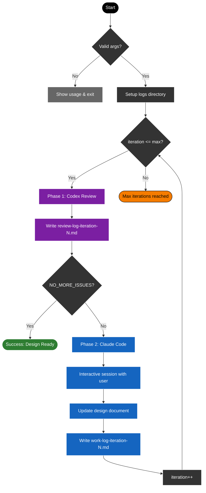

### Architect Review Loop - Collaborative design review between Claude Code and Codex

A bash script that orchestrates iterative design document reviews between two AI architects:
- **Review Architect** (Codex / GPT-5.2): Reviews and identifies blockers
- **Working Architect** (Claude Code / Opus 4.5): Addresses issues interactively with user



#### Usage

```bash
./architect-review-loop.sh <max_iterations> <design_doc_path>
```

#### Arguments

| Argument | Description |
|----------|-------------|
| `max_iterations` | Maximum number of review iterations (positive integer) |
| `design_doc_path` | Path to the design document to review (relative or absolute) |

#### Example

```bash
./architect-review-loop.sh 5 docs/plans/orchestrator-design.md
```

#### Output Structure

```
logs/architect-review-YYYYMMDD-HHMMSS/
├── review-log-iteration-1.md   # Codex review findings
├── work-log-iteration-1.md     # Claude Code changes made
├── review-log-iteration-2.md
├── work-log-iteration-2.md
└── ...
```

#### Exit Conditions

1. **Success**: Codex outputs `NO_MORE_ISSUES` - design is ready for implementation
2. **Max iterations**: Loop limit reached - may need manual continuation

#### Phase Details

**Phase 1 - Review Architect (Codex)**
- Reviews design document for Critical/High blockers
- Tracks issue resolution across iterations
- Limits: max 5 blockers, max 2 new issues after first iteration
- Outputs structured review log with acceptance criteria

**Phase 2 - Working Architect (Claude Code)**
- Reads review feedback
- Addresses issues one-by-one with user approval
- Updates design document directly
- Creates work log summarizing changes
