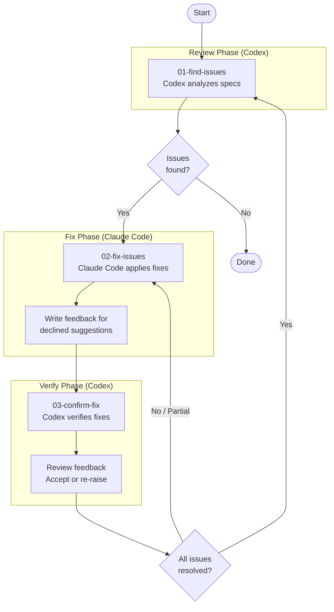

# Spec Review Loop

A systematic review cycle using Codex for analysis and Claude Code for fixes. The loop continues until all spec issues are resolved.

## Flow Diagram



## Steps

| Step | Tool | Purpose |
|------|------|---------|
| 01-find-issues | Codex | Comprehensive spec review to identify gaps and inconsistencies |
| 02-fix-issues | Claude Code | Apply fixes; decline invalid suggestions with documented reasoning |
| 03-confirm-fix | Codex | Verify fixes; review feedback and accept or re-raise declined items |

## Loop Architecture

The system is two nested loops: an **outer discovery loop** that ensures all issues are eventually found, and an **inner fix-verification loop** that ensures each batch of issues is fully resolved before moving on.

### Outer Loop (Discovery)

```
01-find-issues → [inner loop] → 01-find-issues → [inner loop] → … → no issues → DONE
```

Each pass of `01-find-issues` reviews all specs but reports **at most 5 issues**, prioritized by severity. This is intentional batching — it keeps each cycle focused and prevents overwhelming the fix phase. Issues beyond the limit are not lost; they will be discovered in subsequent outer iterations.

The outer loop terminates only when `01-find-issues` finds **zero** issues (currently scoped to Critical and High severity).

### Inner Loop (Fix-Verification)

```
02-fix-issues → 03-confirm-fix → (partial?) → 02-fix-issues → … → all resolved
```

Within each outer iteration, the inner loop cycles between fixing and verifying until every issue from that batch is resolved:

1. **Fix**: Claude Code addresses each issue (AFK or HITL mode)
   - Valid suggestions → apply to specs
   - Invalid suggestions → decline with reasoning in feedback file
2. **Confirm**: Codex verifies fixes and reviews any feedback
   - Partial/missing fixes → return to Fix
   - Re-raised declined items → return to Fix
   - All resolved → exit inner loop, return to outer loop (next `01-find-issues` pass)

### Control Signals

Each step prompt emits a promise tag that serves as a control signal for the orchestrator:

| Signal | Emitted by | Meaning | Orchestrator action |
|--------|-----------|---------|-------------------|
| `<promise>COMPLETE</promise>` | 01-find-issues | No issues found | **Terminate** — all loops end |
| `<promise>ALL_RESOLVED</promise>` | 03-confirm-fix | All batch issues resolved | **Exit inner loop** — trigger next `01-find-issues` pass |
| `<promise>ISSUES_REMAINING</promise>` | 03-confirm-fix | Unresolved issues remain | **Continue inner loop** — trigger `02-fix-issues` again |

### Completeness Guarantee

- **Batching + outer loop = eventual completeness.** The max-5 limit per find pass does not discard issues — it defers them. Each outer iteration surfaces the next highest-priority batch until none remain.
- **Inner loop = no issue left behind per batch.** The fix-verification cycle repeats until every issue in the current batch is either fixed or explicitly accepted as declined.

### Design Note

Step prompts (01, 02, 03) are intentionally stateless and loop-unaware. They do not know they are part of a loop, how many iterations have occurred, or what comes next. All orchestration logic — reading control signals, deciding which step to invoke next, terminating — lives in an external bash loop.
