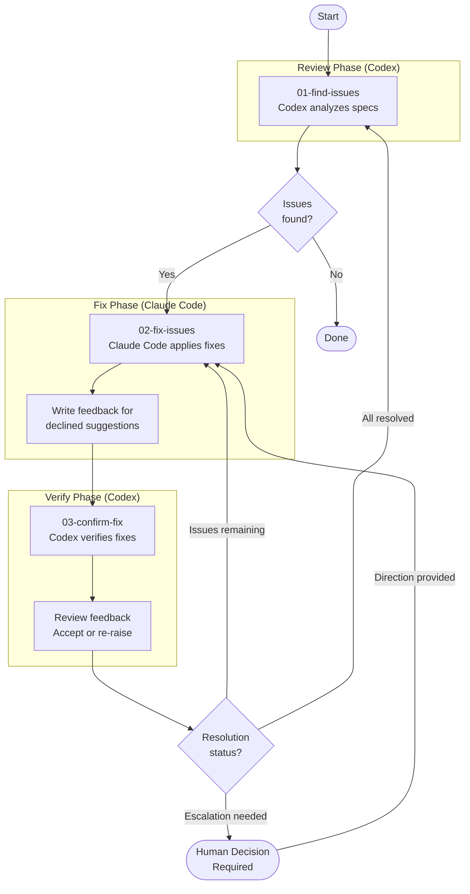

# Spec Review Loop

A systematic review cycle using Codex for analysis and Claude Code for fixes. The loop continues until all spec issues are resolved.

## Flow Diagram

## Steps

| Step | Tool | Purpose |
|------|------|---------|
| 01-find-issues | Codex | Comprehensive spec review to identify gaps and inconsistencies |
| 02-fix-issues | Claude Code | Apply fixes; decline invalid suggestions with documented reasoning |
| 03-confirm-fix | Codex | Verify fixes; review feedback and accept or re-raise declined items |

## Loop Logic

1. **Find**: Codex reviews all specs and outputs issues to `./specs/issues/<date>-v<N>.md`
2. **Fix**: Claude Code addresses each issue (AFK or HITL mode)
   - Valid suggestions → apply to specs
   - Invalid suggestions → decline with reasoning in feedback file
3. **Confirm**: Codex verifies fixes and reviews any feedback
   - Partial/missing fixes → return to Fix (step 2)
   - Re-raised declined items → return to Fix (step 2)
   - Escalated items (declined twice) → pause for human decision, then return to Fix (step 2)
   - All resolved → return to Find (step 1)
4. **Done**: Loop ends when Find discovers no new issues
