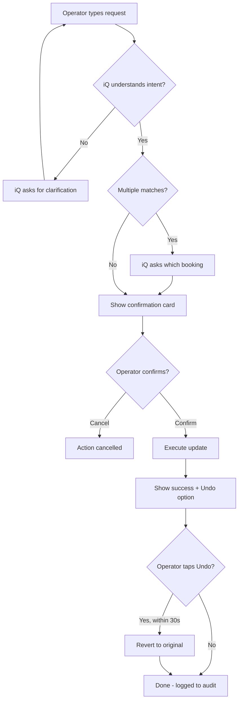

# End State: ROLLER iQ Booking Updates on Mobile (SLC)

> **Simple, Lovable, Complete** — not a half-baked MVP, but a focused, polished slice that delights users.

---

## What This Is

Venue Operators can ask ROLLER iQ to update guest bookings directly from their mobile device. No more navigating away to complete simple changes — just ask, confirm, done.

```
"Change the date of Mr Smith's booking to next Friday"
```

---

## The Core Experience

### What the Operator Sees

```
┌─────────────────────────────────────────┐
│  ROLLER iQ                         ☰   │
├─────────────────────────────────────────┤
│                                         │
│  You: "Move Sarah Chen's booking        │
│        to 3pm tomorrow"                 │
│                                         │
│  ┌─────────────────────────────────┐   │
│  │  📋 Booking Change Request       │   │
│  │                                  │   │
│  │  Guest: Sarah Chen               │   │
│  │  Booking: #BK-4521               │   │
│  │                                  │   │
│  │  ───────────────────────────     │   │
│  │  Current: Sat 1 Feb, 11:00 AM    │   │
│  │  New:     Sun 2 Feb, 3:00 PM     │   │
│  │  ───────────────────────────     │   │
│  │                                  │   │
│  │  [Cancel]           [Confirm]    │   │
│  └─────────────────────────────────┘   │
│                                         │
└─────────────────────────────────────────┘
```

After confirmation:

```
┌─────────────────────────────────────────┐
│                                         │
│  ✓ Booking updated                      │
│                                         │
│  Sarah Chen's booking moved to          │
│  Sun 2 Feb, 3:00 PM                     │
│                                         │
│  [Undo]  ← available for 30 seconds     │
│                                         │
└─────────────────────────────────────────┘
```

---

## The Three Update Actions

These are the booking modifications operators can perform:

| Action | Example Phrase | What Changes |
|--------|----------------|--------------|
| **Reschedule** | "Move John's booking to next Tuesday at 2pm" | Date and/or time |
| **Change Guest Count** | "Add 2 more guests to booking #4521" | Number of participants |
| **Update Contact Details** | "Change the email on Sarah's booking to sarah@new.com" | Guest email or phone |

---

## The Complete Flow



---

## What Makes It Lovable

### Clear Before-and-After
Operators always see exactly what will change before confirming. No surprises.

### One-Tap Undo
Made a mistake? Tap "Undo" within 30 seconds and it's like it never happened.

### Smart Disambiguation
When the operator says "Sarah's booking" and there are multiple Sarahs:

```
┌─────────────────────────────────────────┐
│                                         │
│  I found 2 bookings for "Sarah":        │
│                                         │
│  ○ Sarah Chen - Sat 1 Feb, 11:00 AM     │
│    Party of 4, #BK-4521                 │
│                                         │
│  ○ Sarah Williams - Sun 2 Feb, 2:00 PM  │
│    Party of 2, #BK-4583                 │
│                                         │
│  Which one did you mean?                │
│                                         │
└─────────────────────────────────────────┘
```

### Graceful Boundaries
When operators ask for something outside scope:

```
You: "Cancel the booking entirely"

iQ: "I can help with rescheduling, updating guest counts,
     and changing contact details. For cancellations,
     you'll need to use the Bookings section.

     Would you like help with something else?"
```

---

## Guardrails

| Risk | How We Handle It |
|------|------------------|
| Wrong booking modified | Explicit confirmation showing booking details before any change |
| Accidental changes | 30-second undo window after every update |
| Misheard intent | iQ asks clarifying questions when uncertain |
| Audit requirements | Every action logged with who, what, when, and before/after values |

---

## Audit Trail

Every update is logged and visible:

```
┌─────────────────────────────────────────┐
│  Booking #BK-4521 - Activity Log        │
├─────────────────────────────────────────┤
│                                         │
│  29 Jan 2026, 9:42 AM                   │
│  James (via ROLLER iQ)                  │
│                                         │
│  Rescheduled booking                    │
│  From: Sat 1 Feb, 11:00 AM              │
│  To:   Sun 2 Feb, 3:00 PM               │
│                                         │
│  ─────────────────────────────────────  │
│                                         │
│  28 Jan 2026, 3:15 PM                   │
│  Online booking created                 │
│                                         │
└─────────────────────────────────────────┘
```

---

## What Success Looks Like

For the Venue Operator:
- "I updated the booking without leaving the chat"
- "I could see exactly what was changing before I confirmed"
- "I accidentally picked the wrong one, but I just hit undo"

For the Business:
- Operators resolve simple booking changes faster
- Fewer errors from manual data entry
- Clear audit trail for every change

---

## What's Explicitly Out of Scope

These are not part of this SLC — they're for future iterations:

- Creating new bookings
- Cancelling bookings
- Payment modifications
- Proactive suggestions ("You have 3 bookings to confirm...")
- Learning user preferences over time
- Desktop/web interface
- Slack/Teams integration
- Voice commands

---

## Acceptance Criteria

- [ ] All 3 update actions working end-to-end on mobile
- [ ] Confirmation UI shows clear before/after for every action
- [ ] Undo reverts the booking within the time window
- [ ] Audit log captures all changes with attribution
- [ ] Graceful handling when request is ambiguous or out of scope
